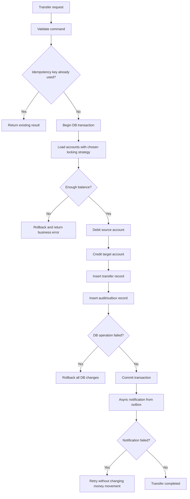

# Topic 01: Spring Transactions In Banking

## Topic Goal

Understand Spring transaction management at Senior/Architect level using a banking money-transfer scenario.

## Mock Interview Question

### Turkish

Bir bankacılık sisteminde `AccountService.transfer(fromAccountId, toAccountId, amount)` metodunu geliştiriyorsun. Metot şu adımları yapıyor:

1. Gönderen hesabı bulur.
2. Alıcı hesabı bulur.
3. Gönderen bakiyesini azaltır.
4. Alıcı bakiyesini artırır.
5. Transfer kaydı oluşturur.
6. Audit log yazar.
7. Bildirim servisine haber verir.

Bu metotta Spring `@Transactional` kullanırken transaction boundary'yi nereye koyarsın? Hangi hatalarda rollback olmalı, hangi yan etkiler transaction içinde olmamalı, isolation level konusunda ne düşünürsün, aynı hesaba paralel transfer gelirse ne gibi riskler oluşur?

Senior bir backend developer gibi cevap ver.

### English

You are implementing `AccountService.transfer(fromAccountId, toAccountId, amount)` in a banking system. The method:

1. Loads the source account.
2. Loads the target account.
3. Debits the source account.
4. Credits the target account.
5. Creates a transfer record.
6. Writes an audit log.
7. Notifies an external notification service.

Where would you place the Spring `@Transactional` boundary? Which failures should trigger rollback, which side effects should stay outside the transaction, what would you consider regarding isolation level, and what risks appear when parallel transfers hit the same account?

Answer like a senior backend developer.

## Draft Mermaid Flow

## Terms To Explain After Learner Answer

- Transaction boundary: the code region protected by a database transaction.
- Rollback: undoing uncommitted database changes after failure.
- Isolation level: how much one transaction can see or interfere with another.
- Idempotency: making repeated requests produce the same safe result.
- Outbox pattern: storing an event in the same DB transaction, then publishing it later.
- Operational risk: risk that a production process failure causes financial, legal, or customer impact.

## Learner Answer Analysis

Date: 2026-05-07

Learner answer: "bu yapıyı bilmiyorum"

### Strong Points

The learner clearly stated the gap instead of guessing. This is useful in interview preparation because it shows where the foundation must be built.

### Missing Points

- What a transaction boundary means.
- Why debit and credit must commit or rollback together.
- Spring rollback behavior.
- Why external service calls should usually not be inside a DB transaction.
- Why isolation and locking matter when multiple transfers hit the same account.
- Why banking systems need auditability and idempotency.

### Risky Misunderstanding To Prevent

Do not think of `@Transactional` as a generic "make this method safe" annotation. It only controls database transaction behavior through Spring's proxy mechanism. It does not automatically make external HTTP calls rollbackable, prevent all concurrency bugs, or guarantee correct business design.

## First Explanation Summary

In a banking transfer, the core database truth is:

- Source account balance is decreased.
- Target account balance is increased.
- Transfer record is inserted.
- Audit/outbox record is inserted.

These should be in the same transaction boundary because either all of them must be committed or none of them should be committed.

External notification should usually not be called inside the transaction. It is a side effect: once an SMS, email, Kafka publish, or HTTP call is made, the database cannot automatically undo it during rollback. A safer design is to write an outbox row inside the same transaction, commit the money movement, then publish notification asynchronously after commit.

## Interview Answer Skeleton

### Turkish

`@Transactional` boundary'yi para hareketinin atomik olması gereken servis metoduna koyarım: debit, credit, transfer kaydı ve audit/outbox kaydı aynı transaction içinde olmalı. DB hatası, constraint ihlali veya beklenmeyen teknik hata varsa rollback gerekir. Dış bildirim servisini transaction içinde çağırmam; bunun yerine outbox pattern kullanırım. Paralel transferlerde aynı hesabın bakiyesi üzerinde lost update veya overdraft riski olabilir, bu yüzden optimistic locking, pessimistic locking veya uygun isolation stratejisi düşünülmelidir.

### English

I would place the `@Transactional` boundary around the atomic money-movement use case: debit, credit, transfer record, and audit/outbox insert should commit or roll back together. Database errors, constraint violations, and unexpected technical failures should trigger rollback. I would not call an external notification service inside the transaction; I would use the outbox pattern instead. With parallel transfers on the same account, we must consider lost updates or overdraft risk, so optimistic locking, pessimistic locking, or an appropriate isolation strategy is required.

## Follow-Up Gap: External HTTP Calls

Question:

Can `@Transactional` roll back an external HTTP call?

Learner answer:

"bilmiyorum"

Correct short answer:

No. `@Transactional` cannot roll back an external HTTP call. It can roll back database changes made inside the transaction, but it cannot undo something already sent to another system.

Turkish explanation:

Bir DB transaction, veritabaninin kendi icindeki degisiklikleri kontrol eder. Mesela account balance update, transfer insert veya outbox insert rollback edilebilir. Ama HTTP ile baska bir servise "transfer tamamlandi" diye haber verdiysen, bu artik veritabaninin kontrol ettigi bir sey degildir. DB rollback olsa bile karsi sistem o HTTP istegini almis olabilir.

Banking impact:

Eger musteriye "para gonderildi" bildirimi transaction commit olmadan giderse ve sonra DB rollback olursa, musteri yanlis bilgi alir. Daha kotusu, karsi sistem bu bildirimi gercek bir is emri gibi isleyebilir. Bu nedenle dis etkiler commit sonrasina tasinmali veya outbox pattern ile guvenli hale getirilmelidir.

English explanation:

A database transaction controls changes inside the database transaction resource. It can roll back account updates, transfer inserts, or outbox inserts. But if you send an HTTP request to another service, the database cannot undo that external side effect. The other service may already have received and processed the request.

Senior phrasing:

I would avoid external HTTP calls inside the database transaction because they are not rollbackable by the database. I would persist an outbox event in the same transaction and publish it after commit with retry and idempotency.

## Follow-Up Answer Analysis: SMS Failure

Question:

If SMS notification fails, should we roll back the money-transfer transaction?

Learner answer:

"hayir tabiki de onemli olan para transferi, sms gonderimi sadece bilgi amacli sonucta"

### Strong Points

The learner correctly separated the core financial transaction from the notification side effect. This is the right mental model: money movement is the system of record, while SMS is a communication concern.

### Senior-Level Correction

Do not say "SMS is unimportant" in an interview. In banking, customer communication still matters, but it should not decide whether the money movement commits. A stronger answer is: "I would not roll back a successfully committed money transfer because SMS failed. I would record notification intent through an outbox and retry it after commit. I would also monitor failures and alert operations if notification delivery is repeatedly failing."

### Turkish Interview Answer

SMS basarisiz oldu diye para transferi transaction'ini rollback etmem. Para transferi sistemin finansal gercegidir; SMS ise dis yan etkidir ve transaction disinda, retry edilebilir sekilde yonetilmelidir. Ancak SMS'i tamamen onemsiz saymam: outbox kaydi, retry mekanizmasi, monitoring ve gerekirse operasyonel alarm ile takip ederim.

### English Interview Answer

I would not roll back a successfully committed money-transfer transaction just because SMS delivery failed. The money movement is the financial source of truth, while SMS is an external side effect. I would handle notification through an outbox, retry delivery after commit, monitor failures, and alert operations if delivery keeps failing.

## Follow-Up Answer Analysis: Credit DB Failure After Debit

Question:

During a money transfer, 100 TL is debited from the source account, then a database error occurs while crediting the target account. What should happen? What does `@Transactional` do here?

Learner answer:

"tum adimlar rollback edilmeli, para dusulen hesaba tekrar iade edilmeli"

### Strong Points

The learner correctly understood the atomicity rule: a transfer must not be half-completed. Debit and credit must succeed together or fail together.

### Senior-Level Correction

If both debit and credit are inside the same uncommitted DB transaction, we usually do not perform a separate "refund" operation. Rollback means the debit update is never committed, so the source balance returns to its previous committed state automatically.

If the debit had already been committed in a previous transaction and the credit failed later, that would be a different and more dangerous distributed consistency problem. Then a compensating transaction might be needed. But within one local DB transaction, rollback is the correct mechanism.

### Turkish Interview Answer

Debit ve credit ayni `@Transactional` boundary icindeyse, credit sirasinda DB hatasi olursa tum transaction rollback edilmelidir. Bu durumda debit islemi de commit edilmez; yani para ayrica manuel iade edilmez, veritabani onceki committed state'e geri doner. Banking sisteminde yarim transfer kabul edilemez.

### English Interview Answer

If debit and credit are inside the same `@Transactional` boundary, a database failure while crediting the target account should roll back the whole transaction. The debit is not committed either, so we do not need a separate refund operation. The database returns to the previous committed state. A half-completed transfer is not acceptable in a banking system.
